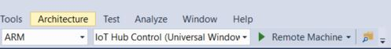

# Ejercicio comunicación Raspberry Pi con IoT Hub

## Objetivo ##

En este ejercicio la intención es aprender a utilizar la funcionalidad completa de IoT Hub desde una Raspberry Pi.

La funcionalidad que utilzaremos del IoT Hub será:

    - Manejo de dispositivos desde un IoT Hub
    - Envío de información desde el dispositivo a la nube
    - Envío de información desde la nube al dispositivo

## El material ##

El material utilizado será el siguiente:

- Una Raspberry Pi (puede ser modelo 2 o 3).

- Un [FEZHAT Shield](https://www.ghielectronics.com/catalog/product/500)  de GHI Electronics.
Todos los accesorios requeridos para trabajar como cable de corriente eléctrica, mouse, cable de red o tarjeta de conexión inalámbrica.

En cuanto a software, el siguiente está considerado.

- [Visual Studio 2017](https://www.visualstudio.com/es/downloads/) con el SDK para desarrollo de Aplicaciones Universales.

- Una suscripción activa de [Microsoft Azure](https://azure.microsoft.com/es-mx/).

- Es deseable instalar la aplicación de [Windows IoT Remote Client](https://www.microsoft.com/es-mx/store/p/windows-iot-remote-client/9nblggh5mnxz) de la tienda de aplicaciones de Windows 10.


## La configuración ##

Entra al portal de Azure y en la opción de agregar nuevos recursos selecciona la categoría de Internet of things y ahí selecciona IoT Hub.


En el menú que aparece, escribe los datos como se muestra en la imagen siguiente.


Considera los siguientes datos para la creación de tu hub y créalo.

| Concepto | Descripción |
| --------- | -------------------- |
| Nombre | Es el nombre identificador con el que podrás acceder a tu hub mediante un sub dominio |
| Capa de costos | Es el tipo de plan que vas a utilizar, obviamente a mayores montos de información mayor será el costo del pago |
| Unidades de IoT | Son las unidades con las que vas a poder calcular la couta de mensajes diarios recibidos |
| Particiones | El número de particiones para los mensajes, por defecto te ofrecerá cuatro y para este ejercicio serán más que suficientes |
| Suscripción | Aparecerá el nombre de tu suscripción |
| Grupo de recursos | Siempre es recomendable crear uno nuevo para estos ejercicios, podrás borrarlo todo si ya no deseas continuar con esto para lograr ahorrar consumo |
| Ubicación | West US es la mejor ubicación para cualquier ubicación en México |

Con tu Hub ya creado, ve a este sitio y descarga el [IoT Device Explorer](https://github.com/Azure/azure-iot-sdk-csharp/releases), una herramienta imprescindible para controlar todos tus hubs y la gestión de sus dispositivos.

Mientras lo descargas regresa a tu portal y ya ahí, con el Hub creado podrás entonces ir a la opción de **Shared access policies**.


Al haber seleccionado esta opción te aparecen varias políticas, ahí, selecciona la primera, se llama **iothubowner**. Ya seleccionada, verás ciertos valores que te permitirán el acceso por medio de esta política al hub, estás usando la política con más privilegios únicamente porque se trata de un ejercicio. Lo ideal es que uses una política adecuada a cada escenario que vayas a tener, esto incrementará mucho la seguridad de tu infraestructura. Ya que hayas seleccionado la opción sugerida, entonces copia los valores de tu cadena de conexión (es el tercer valor).


Pega este valor dentro del campo de información de conexión en tu explorador, después de hacerlo presiona el botón de actualizar y un mensaje indicando que todo esta bien hecho te confirmará que hasta aquí vas bien.


Si hasta aquí todo va bien entonces debes pasar a la pestala de **Administración** donde por ahora verás todo en blanco porque hasta ahora no hay dispositivos creados para este Hub. Esto lo puedes solucionar fácilmente presionando el botón **Crear** y en el menú emergente escribe el nombre de tu dispositivo para que al final presiones el botón de **Crear**.


Para confirmar que todo está bien hasta ahora, ya debe aparecerte el dispositivo recién creado en la lista de la sección.


Da un clic derecho sobre este dispositivo y selecciona la opción de **Copiar cadena de conexión para el dispositivo seleccionado**.


Anota esta cadena de conexión en algún bloc de notas, si la separas en tres renglones diferentes podrás ver algo como lo siguiente.


## El desarrollo de las aplicaciones ##

Abre Visual Studio 2017 y crea una nueva solución que tenga una aplicación universal. 


Con la solución ya creada, agrega un nuevo proyecto de tipo Consola.


Para comprobar que todo está en orden deberás tener tu solución formada de la siguiente manera.


Empezaremos primero con el cliente, abre el archivo **MainPage.xaml** y escribe el siguiente código dentro de **Page**, nota que en la línea 7 hay un control de tipo **ImageBrush** y tiene una referencia a una imagen, busca un buen fondo de pantalla y ponlo en la carpeta marcada, esto le dará una buena apariencia a tu aplicación. Dos líneas después tendrás un archivo mp3 que debes descargar desde [aquí](http://aminespinoza.com/ascend/audio/alarm.mp3), este archivo lo debes subir en la misma ruta marcada, dentro de la carpeta **Assets/Audio**, 

```c
    <Grid>
        <Grid.ColumnDefinitions>
            <ColumnDefinition Width="*"/>
            <ColumnDefinition Width="*"/>
        </Grid.ColumnDefinitions>
        <Grid.Background>
            <ImageBrush Stretch="Fill" ImageSource="Assets/Fondos/fondoApp.jpg"/>
        </Grid.Background>
        <MediaElement x:Name="audioAlarm" Source="Assets/Audio/alarm.mp3" AutoPlay="False" />
        <Rectangle Fill="#33000000" Margin="0" Grid.ColumnSpan="2"/>
        <TextBlock x:Name="txtLuz" HorizontalAlignment="Left" Margin="10,70,0,0" TextWrapping="Wrap" Text="Nivel de luz:" VerticalAlignment="Top" Foreground="White" FontSize="26.667"/>
        <TextBlock x:Name="txtTemperatura" HorizontalAlignment="Left" Margin="10,120,0,0" TextWrapping="Wrap" Text="Temperatura:" VerticalAlignment="Top" Foreground="White" FontSize="26.667"/>
        <TextBlock x:Name="txtAcelerometro" HorizontalAlignment="Left" Margin="10,170,0,0" TextWrapping="Wrap" Text="Acelerómetro:" VerticalAlignment="Top" Foreground="White" FontSize="26.667"/>
        <Button x:Name="btnInformacion" Content="Enviar información" Margin="10,230,0,0" VerticalAlignment="Top" Width="220" Foreground="White" FontSize="18.667" Height="49" BorderBrush="White" Click="btnInformacion_Click"/>
        <TextBlock HorizontalAlignment="Left" Margin="10,10,0,0" TextWrapping="Wrap" VerticalAlignment="Top" Foreground="White" FontSize="32" Grid.Column="1">
            <Run Text="Acciones"/>
            <Run Text=":"/>
        </TextBlock>
        <Grid x:Name="gridRojo" Grid.Column="1" Height="44" Margin="10,70,96,0" VerticalAlignment="Top" Visibility="Collapsed">
            <Ellipse x:Name="elipseRoja" Fill="Red" HorizontalAlignment="Left" Stroke="White" Width="44" StrokeThickness="3" d:LayoutOverrides="TopPosition, BottomPosition"/>
            <TextBlock x:Name="txtRojo" Margin="55,10,0,9" TextWrapping="Wrap" Text="Luz roja: Encendida" Foreground="White" FontSize="18.667" d:LayoutOverrides="TopPosition, BottomPosition" HorizontalAlignment="Left"/>
        </Grid>
        <Grid x:Name="gridVerde" Grid.Column="1" Height="44" Margin="10,130,82,0" VerticalAlignment="Top" Visibility="Collapsed">
            <Ellipse x:Name="elipseVerde" Fill="Lime" HorizontalAlignment="Left" Stroke="White" Width="44" StrokeThickness="3" d:LayoutOverrides="TopPosition, BottomPosition"/>
            <TextBlock x:Name="txtVerde" Margin="55,10,0,9" TextWrapping="Wrap" Text="Luz verde: Encendida" Foreground="White" FontSize="18.667" HorizontalAlignment="Left" d:LayoutOverrides="TopPosition, BottomPosition"/>
        </Grid>
        <Grid x:Name="gridAzul" Grid.Column="1" Height="44" Margin="10,190,94,0" VerticalAlignment="Top" Visibility="Collapsed">
            <Ellipse x:Name="elipseAzul" Fill="Blue" HorizontalAlignment="Left" Height="44" Stroke="White" VerticalAlignment="Top" Width="44" StrokeThickness="3"/>
            <TextBlock x:Name="txtAzul" Margin="55,10,0,0" TextWrapping="Wrap" Text="Luz azul: Encendida" VerticalAlignment="Top" Foreground="White" FontSize="18.667" Height="25" HorizontalAlignment="Left"/>

        </Grid>

    </Grid>
```
Ya que tienes la interfaz, debes agregar dos paquetes de Nuget para utilizar en la solución.


Búscalos como aparecen en la imagen.


Ya con estos dos paquetes de NuGet agregados en tu solución, debes agregar uno más desde el administrador de referencias.


En el administrador ve a la opción de **Aplicaciones universales de Windows**, selecciona **Extensiones** y busca la opción de IoT para agregarla a tu proyecto.


Ahora que ya tienes todas las referencias de ambas fuentes que requieres es momento de agregar un poco más de código. Declara las siguientes variables globales en tu clase **MainPage.xaml.cs**

```c
FEZHAT shield;
private DispatcherTimer timer;
bool isSendingInformation = false;

static DeviceClient deviceClient;
static string iotHubUri = "";
static string deviceKey = "";
static string deviceId = "";

double valorNivelLuz = 0;
```
Como puedes ver se trata de todos los objetos que vamos a utilizar durante la aplicación, el valor DeviceClient es el que hará toda la comunicación con el IoT Hub, aquí es donde debes copiar los valores de tu dispositivo IoT creado desde tu **Device Explorer**. De hecho son los datos que pusiste en el bloc de notas.

```c
FEZHAT shield;
private DispatcherTimer timer;
bool isSendingInformation = false;

static DeviceClient deviceClient;
static string iotHubUri = "testingHub2017.azure-devices.net";
static string deviceKey = "l8gGqLkHVW2XyC46+bSq7iSTqKycW6QHTK4x/cdie20=";
static string deviceId = "maquina001";

double valorNivelLuz = 0;
```
Después de tener tus variables completas, agrega un método sobre escrito, el nombre del método es **OnNavigatedTo** con la siguiente funcionalidad.

```c
protected async override void OnNavigatedTo(NavigationEventArgs e)
    {
        base.OnNavigatedTo(e);

        deviceClient = DeviceClient.Create(iotHubUri, AuthenticationMethodFactory.CreateAuthenticationWithRegistrySymmetricKey(deviceId, deviceKey), TransportType.Http1);

        RecibirInformacionDelHub();

        shield = await FEZHAT.CreateAsync();
        timer = new DispatcherTimer();
        timer.Interval = TimeSpan.FromSeconds(1);
        timer.Tick += Timer_Tick;
        timer.Start();
    }
```
Este método se lanzará inmediatamente después de que la página se ponga en la pantalla así qie iniciará la configuración de deviceClient, invocará un método para escuchar información desde la nube, creará la instancia del dispositivo FEZHAT y finalmente iniciará un temporizador que usaremos para enviar información.

Después de esto, agrega el siguiente método.
```c
private void Timer_Tick(object sender, object e)
        {
            double x, y, z;
            this.shield.GetAcceleration(out x, out y, out z);

            valorNivelLuz = shield.GetLightLevel();

            txtLuz.Text = "Luminosidad: " + valorNivelLuz.ToString("P2");
            txtTemperatura.Text ="Temperatura: " + shield.GetTemperature().ToString("N2") + "°C";
            txtAcelerometro.Text = "Acelerómetro: x:" 
                + x.ToString("N2") + " y:" 
                + y.ToString("N2") + " z:" 
                + z.ToString("N2");

            if (isSendingInformation)
            {
                EnviarInformaciónAlHub(valorNivelLuz.ToString("P2"));
            }
        }
```
Este método es el lanzador de cada ocasión que el intervalo se haya cumplido, es fácil, como puedes ver obtendrá datos desde el shield y los desplegará en las cajas de texto correspondientes y, en caso de que la variable sea verdadera, enviará la información del sensor de luz a la nube. Para hacer esta variable verdadera solo se necesita hacerlo desde el botón.

```c
private void btnInformacion_Click(object sender, RoutedEventArgs e)
{
    isSendingInformation = true;
}
```

El método que el manejador de tiempo utiliza para enviar información es el siguiente.

```c
private async void EnviarInformaciónAlHub(string nivelLuz)
{
    var telemetryDataPoint = new
    {
        deviceId = deviceId,
        lightLevel = nivelLuz,
        date = DateTime.Now
    };

    var messageString = JsonConvert.SerializeObject(telemetryDataPoint);
    var message = new Message(Encoding.ASCII.GetBytes(messageString));

    Debug.WriteLine(messageString);
    await deviceClient.SendEventAsync(message);
}
```
El método siguiente es para recibir información desde el Hub, recuerda que no solo es necesario enviar información sino también tener la capacidad de recibirla. Usaremos el mísmo objeto, deviceClient pero en esta ocasión para recibir. Una vez recibida cualquier cosa podremos dar el formato correcto para después ejecutar el método que se encargará de procesar la información recibida.
```c
private async void RecibirInformacionDelHub()
{
    while (true)
    {
        var receivedMessage = await deviceClient.ReceiveAsync();

        if (receivedMessage == null) continue;

        if (receivedMessage != null)
        {
            var messageData = Encoding.ASCII.GetString(receivedMessage.GetBytes());
            ProcesarComando(messageData);
        }

        await deviceClient.CompleteAsync(receivedMessage);
    }
}
```
Este método solo recibirá el valor de la nube y actuará de una manera muy simple pero responsiva a cada escenario marcado. Como puedes ver, con un solo valor puedes desencadenar mucha funcionalidad e incluso hacer tareas más complejas como en el caso 5 y 6 que invocan a otros métodos.
```c
private void ProcesarComando(string mensajeRecibido)
{
    switch (mensajeRecibido)
    {
        case "1":
            shield.D2.Color = FEZHAT.Color.Red;
            shield.D3.Color = FEZHAT.Color.Red;
            gridRojo.Visibility = Visibility.Visible;
            gridVerde.Visibility = Visibility.Collapsed;
            gridAzul.Visibility = Visibility.Collapsed;
            break;
        case "2":
            shield.D2.Color = FEZHAT.Color.Green;
            shield.D3.Color = FEZHAT.Color.Green;
            gridRojo.Visibility = Visibility.Collapsed;
            gridVerde.Visibility = Visibility.Visible;
            gridAzul.Visibility = Visibility.Collapsed;
            break;
        case "3":
            shield.D2.Color = FEZHAT.Color.Blue;
            shield.D3.Color = FEZHAT.Color.Blue;
            gridRojo.Visibility = Visibility.Collapsed;
            gridVerde.Visibility = Visibility.Collapsed;
            gridAzul.Visibility = Visibility.Visible;
            break;
        case "4":
            shield.D2.TurnOff();
            shield.D3.TurnOff();
            gridRojo.Visibility = Visibility.Collapsed;
            gridVerde.Visibility = Visibility.Collapsed;
            gridAzul.Visibility = Visibility.Collapsed;
            break;
        case "5":
            ModoPolicia();
            break;
        case "6":
            ModoAlerta();
            break;

        default:
            
            break;
    }
}
```
El método invocado en el caso 5 realizará una funcionalidad cíclica emulando las luces de un auto de policía.
```c
private async void ModoPolicia()
{
    for (int i = 0; i < 20; i++)
    {
        shield.D2.Color = FEZHAT.Color.Red;
        await Task.Delay(TimeSpan.FromMilliseconds(500));
        shield.D2.TurnOff();
        shield.D3.Color = FEZHAT.Color.Blue;
        await Task.Delay(TimeSpan.FromMilliseconds(500));
        shield.D3.TurnOff();
    }
}
```
El método invocado en el caso 6 realizará una funcionalidad cíclica emulando una alerta sísmica, en este caso reproducirás el archivo de audio que descargaste y además encenderás las luces, ¡no olvides poner una salida de audio para tener toda la experiencia!
```c
private async void ModoAlerta()
{
    audioAlarm.Play();

    for (int i = 0; i < 8; i++)
    {
        shield.D2.Color = FEZHAT.Color.Cyan;
        shield.D3.Color = FEZHAT.Color.Cyan;
        await Task.Delay(TimeSpan.FromMilliseconds(500));
        shield.D2.TurnOff();
        shield.D3.TurnOff();
        await Task.Delay(TimeSpan.FromMilliseconds(500));
    }
}
```

Hasta aquí podrás jugar ya con la aplicación, para ejecutarla en tu Raspberry Pi necesitas primero establecer la dirección IP del dispositivo. Cambia la arquitectura del procesador a **ARM** y selecciona la opción de **Máquina remota**.



Si es la primera vez que lo haces te aparecerá un asistente. En caso contrario da un clic derecho sobre el proyecto y escoge la opción de **Propiedades**.

 

En la sección de **Depuración** podrás escribir la dirección IP del nuevo dispositivo o su nombre.

 

¡Listo! Ya ejecutándose la aplicación lucirá de la siguiente manera.

 

Al momento de presionar el botón no verás una diferencia en la aplicación pero si abres tu explorador de dispositivos de IoT podrás ver la información. Selecciona la pestaña **Datos** y en la categoría de **Device ID** asegúrate de que tu dispositivo esté seleccionado, presiona el boton de **Monitor** y podrás comenzar a ver la información recibida por el Hub en formato JSON.

 

Ahora también podrás usar el explorador de dispositivos para enviar comandos a tu aplicación. Selecciona la pestaña de **Mensajes al dispositivo** y escribe "1" en el espacio de **Mensaje**.

 

En la interfaz de tu aplicación podrás ver que se muestra el color rojo encendido y los leds del shield también estarán del mismo color.

 

Como puedes ver, ya tienes los dos canales de comunicación desde el explorador de dispositivos y lo más importante es que puedes usar esta útil herramienta para ver que la funcionalidad de tu aplicación esté lista y sin problemas. Ahora vamos por la última parte del ejercicio, una aplicación de terminal que enviará los mismos comandos que acabas de enviar desde el explorador de dispositivos.

## La aplicación de terminal ##

En el proyecto que creaste de consola al inicio necesitas agregar un paquete de NuGet que se llama **Microsoft.Azure.Devices** y solo por diversión agrega uno más que se llama **Colorful.Console**, este paquete lo único que hace es convertir texto en caracteres ASCII.

 

Agrega las siguientes sentencias using.

```c
using Microsoft.Azure.Devices;
using System.Drawing;
using System.Text;
using Console = Colorful.Console;
```

Dentro de la clase, agrega dos variables globales, la segunda es una cadena que servirá como cadena de conexión. Considera que aquí vas a usar la misma cadena de conexión que usaste para configurar tu explorador de dispositivos, de hecho de ahí mismo te puedes copiar la conexión.
```c
static ServiceClient serviceClient;
static string connectionString = "HostName=testingHub2017.azure-devices.net;SharedAccessKeyName=iothubowner;SharedAccessKey=VNKQRKIGFSA2VA3nP97PBs6fdgIUbbRYwo9ACwQQj5M=";
```

En tu sentencia **Main** desplegarás el menú de opciones, obtendrás el valor que el usuario ingrese y lo enviarás al método **EnviarComandoParaDispositivo**.
```c
static void Main(string[] args)
{
    serviceClient = ServiceClient.CreateFromConnectionString(connectionString);

    Console.WriteAscii("IOT HUB CONTROL", Color.White);
    Console.ForegroundColor = Color.WhiteSmoke;
    Console.WriteLine("----------Control de luces----------");
    Console.WriteLine("----------Menú principal------------");
    Console.WriteLine("1 Encender luz roja");
    Console.WriteLine("2 Encender luz verde");
    Console.WriteLine("3 Encender luz azul");
    Console.WriteLine("4 Apagar luces");
    Console.WriteLine("5 Modo policía");
    Console.WriteLine("6 Modo alerta");
    Console.WriteLine("------------------------------------");
    Console.WriteLine("Selecciona tu opción");

    string valorRecibido = Console.ReadLine();

    EnviarComandoParaDispositivo(valorRecibido);
    Console.Clear();
    Main(null);
}
```
 El método mencionado es el siguiente.
```c
 private async static void EnviarComandoParaDispositivo(string mensajeEnviado)
{
    var commandMessage = new Message(Encoding.ASCII.GetBytes(mensajeEnviado));
    await serviceClient.SendAsync("maquina001", commandMessage);
}
```

El método es muy simple y poderoso, como ves solo transforma el mensaje y lo envía al nombre del dispositivo, si lo ves de esta manera podrías colocar el nombre del dispositivo como parámetro y así podrías apuntar a muchos dispositivos desde un solo comando. La apariencia final lucirá de la siguiente manera.

 

## Resumen ##

El IoT Hub es una de las características más simples y poderosas de Azure y como puedes ver, también es sumamente fácil de configurar. Si has llegado hasta aquí significa que ya concluiste el ejercicio correctamente. Como prácticas de seguimiento podría ser muy buena idea que hicieras las siguientes modificaciones.

    - Cambia el ejercicio de consola por una interfaz hecha en WPF y quizá controlando diferentes dispositivos.
    - ¿Qué otro dispositivo se te ocurre agregar al shield de la Raspberry?
    - Y si usas otros sensores sin utilizar el shield?

Cualquier duda comentario o retroalimentación sugerida para este repositorio públicalo dentro de la categoría de **Issues** para poder leerlo de prisa.

**@aminespinoza**
